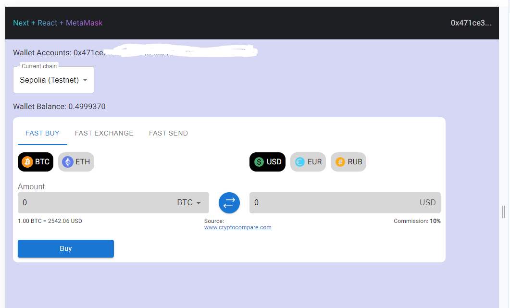

# Crypto Wallet
Тестовое задание

### Ссылка на проект: https://test-crypto-wallet.vercel.app/

## Функционал
* подключение к Chrome extension Metamask (https://metamask.io/)
* виджет для покупки и обмена валют (интерактивный, но без запросов на API)
* обмен тестовых монет

## Стек
* TypeScript
* Next.js
* Material UI (MUI)
* Metamask
* bn.js
* SVGR
* HTML5, CSS3, адаптивный дизайн

## Известные проблемы
* При переводе тестовых монет с некоторыми величинами происходит ошибка парсинга в 16-тиричную систему счисления

## Можно улучшить
* Добавить реакцию на результат транзакции
